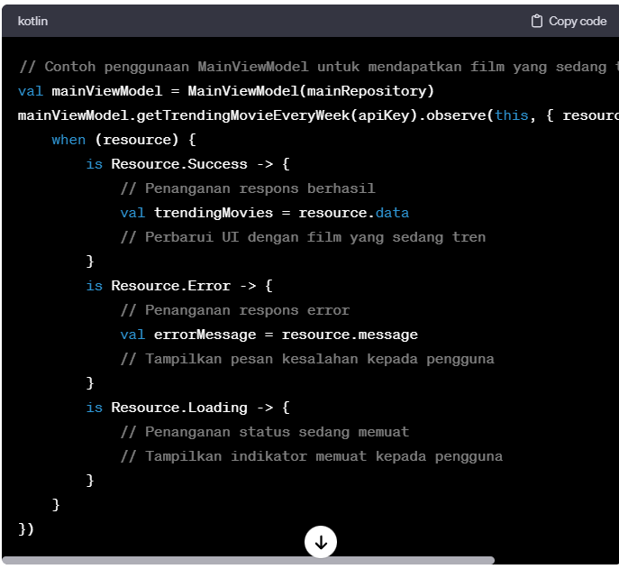

**FilmKu App**
*Deskripsi*
FilmKu adalah aplikasi Android yang memberikan informasi tentang film-film yang sedang tren dan memberikan rekomendasi berdasarkan peringkat dan rilis terbaru. Aplikasi ini menggunakan API Movie Database **(TMDb)** untuk mengambil data tentang film-film.

**MainViewModel**
Deskripsi Kelas
Kelas MainViewModel bertanggung jawab atas manajemen dan penanganan operasi data terkait tampilan utama aplikasi FilmKu. Kelas ini berinteraksi dengan MainRepository untuk mengambil data dari API TMDb dan menyediakan data ini ke komponen UI.

**Metode**
1. getTrendingMovieEveryWeek(apiKey: String): LiveData<Resource<TrendingResponse>>
Deskripsi: Mengambil daftar film yang sedang tren setiap minggu.
Parameter:
apiKey (String): Kunci API TMDb untuk otentikasi.
Mengembalikan: LiveData tipe Resource<TrendingResponse>.
2. getLatestMovieReleased(apiKey: String, language: String): LiveData<Resource<MovieResponse>>
Deskripsi: Mendapatkan rilis film terbaru.
Parameter:
apiKey (String): Kunci API TMDb untuk otentikasi.
language (String): Preferensi bahasa untuk informasi film.
Mengembalikan: LiveData tipe Resource<MovieResponse>.
3. getMovieAction(apiKey: String, genreID: String, page: String): LiveData<Resource<MovieResponse>>
Deskripsi: Mengambil daftar film aksi berdasarkan genre dan paginasi.
Parameter:
apiKey (String): Kunci API TMDb untuk otentikasi.
genreID (String): ID genre untuk film aksi.
page (String): Nomor halaman untuk paginasi.
Mengembalikan: LiveData tipe Resource<MovieResponse>

**Penggunaan**

**MainRepository**
Untuk pemahaman yang lebih lengkap tentang struktur aplikasi, harap merujuk ke kelas MainRepository di paket repository.

**Instalasi**
Klon repository: git clone https://github.com/namauser/FilmKu.git
Buka proyek di Android Studio.
Tambahkan kunci API TMDb Anda di tempat-tempat yang sesuai.
Jalankan aplikasi pada emulator atau perangkat fisik.

**Lisensi**
Proyek ini dilisensikan di bawah MIT License.
